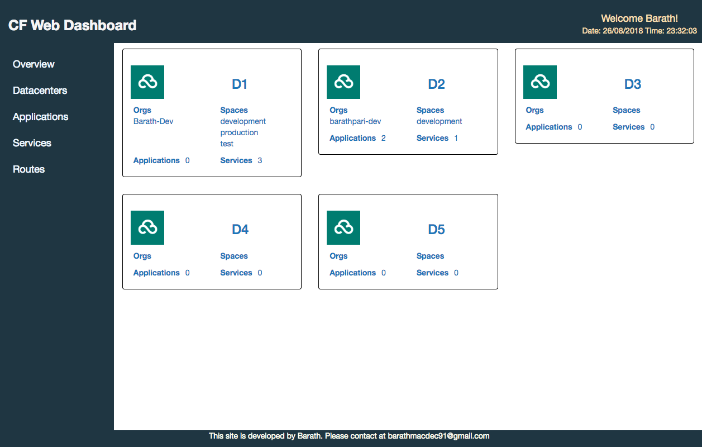
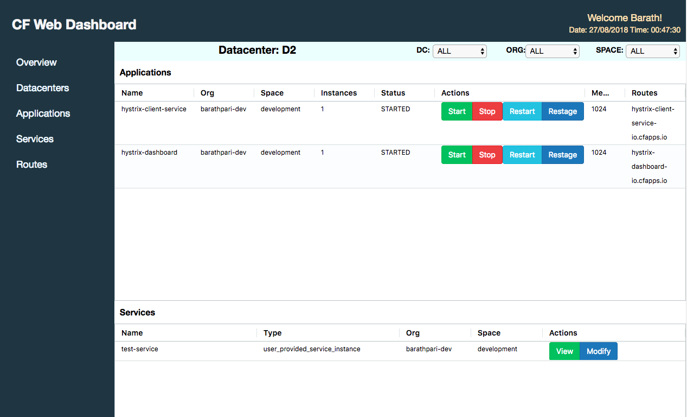

# cloud-foundry-web-dashboard
A simple web angular dashboard built to manage applications and services across cloud foundry datacenters.

### Dashboard Overview

This view showcases all the datacenters that are configured with the list of orgs,spaces,applications and services.

### Datacenter Overview

This view showcases all the applications & services under a particular datacenter.

# Ideation

The idea of this project is to manage multiple PCF datacenters across different regions under single UI.
PCF apps manager is limited to one datacenter. 
